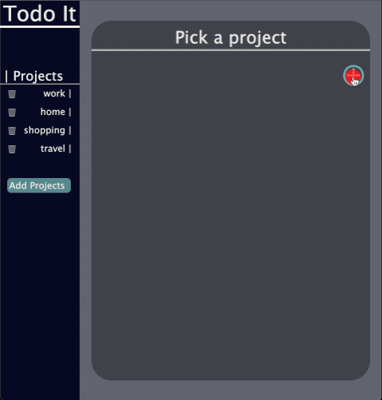

# Todo List

From [the Odin Project](http://www.theodinproject.com/)'s Full-Stack JS curriculum.

It aims at practicing modules, factory functions, SOLID rules, working with webpack, and other aspects of Object Oriented Programming.

Make projects, add tasks with deadlines and four levels of urgency. 
[Live Demo](https://kamyar-mazloom.github.io/todo-list/) :point_left:

